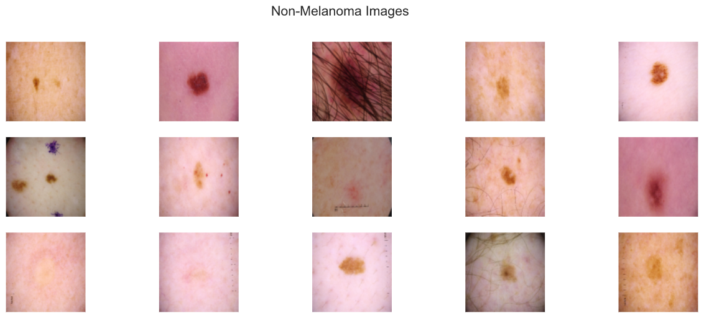
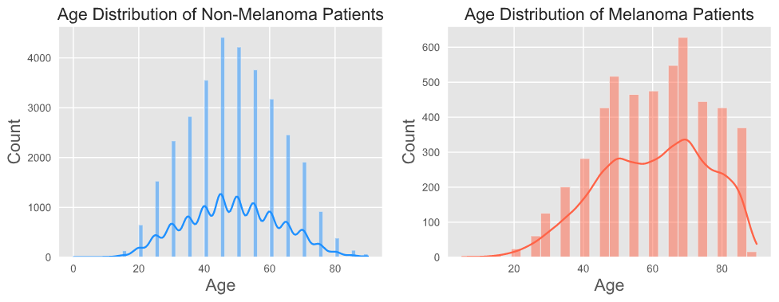
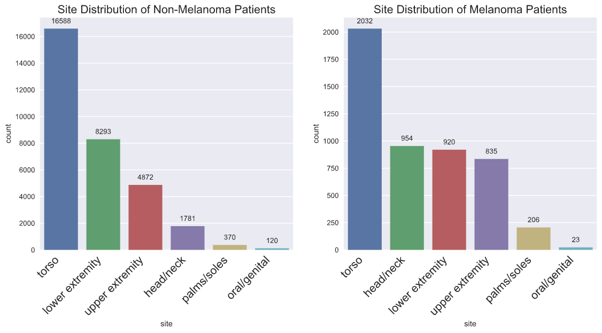

# Melanoma Image Classification Model for App Deployment

**Project Author:**  Steven Yan

**Project Advisor:**  Justin Tannenbaum

**Presentation Link:** https://prezi.com/view/JoLKnGuw0ZFBYFZra0c3/

Final capstone project for Flatiron School Data Science Online Immersive Program

## Overview

Skin cancer is the most prevalent type of cancer with melanoma being responsible for 75% of skin cancer deaths despite being the least common type. According to the American Cancer Society, in 2021, about 106,000 new melanomas will be diagnosed with a 60/40 split between men and women, and just over 7000 people are expected to die of melanoma.  Melanoma is the deadliest form of skin cancer and is responsible for an overwhelming majority of skin cancer deaths.  When melanoma is detected early, the survival rate exceeds 95% and can be cured with minor surgery. which is the very reason why having access to some sort of screening process as essential to prevent unnecessary death.

## Business Understanding:

Doctors can detect melanomas through visual inspection supplemented by their years of clinical experience, but recent studies have shown that machine learning can detect such lesions through image analysis can be as reliable as if not more than a visit with the dermatologist.  

Deploying an app for public consumption that can screen for potential melanoma will prevent countless avoidable deaths and help stave off unnecessary future medical costs.  The project has also very little overhead for such a maximal effect, the biggest bang for your buck.  According to the Ameerican Journal of Preventive Medicine, the total yearly cost of skin cancer treatment in the United States is around 5 billion for nonmelanoma skin cancers like BCC and SCC, while melanoma will cost around 3 billion.  

Lastly, it will begin to address some of the inherent social inequities in healthcare and equalize access to expert advice for people from every background.   According to the American Cancer Society, the 5-year survival rate of African-American patients is 69%, while for Caucasians it is 94%, granted the lifetime risk of getting melanoma is over 20 times higher than for non-Hispanic Caucasians.

What could also explain the difference in the survival rates?  Those very populations inherently have constructed a certain skepticism and reticence to relate to and seek advice from a doctor of a different ethnic background.  Some of these barriers are due to past offenses and some purely cultural.  Creating such an app would allow for access by such individuals and break down some of these initial barriers so that they may receive the care they truly need.

## Data Sources:

As the leading healthcare organization for informatics in medical imaging, the Society for Imaging Informatics in Medicine (SIIM)'s mission is to advance medical imaging informatics through education, research, and innovation in a multi-disciplinary community. SIIM is joined by the International Skin Imaging Collaboration (ISIC), an international effort to improve melanoma diagnosis. The ISIC Archive contains the largest publicly available collection of quality-controlled dermatoscopic images of skin lesions.

There are three public repositories curated by SIIM-ISCC that we relied on for the project:

**2020 ISIC Training Dataset:**

- 33,126 DICOM images with embedded metadata and JPEG images with 425 duplicates
- 33,126 metadata entries of patient ID, lesion ID, sex, age, and general anatomic site
- 33,126 entries of gold standard lesion diagnoses

The 2020 dataset contains 33,126 dermatoscopic training images of skin lesions from over 2000 patients, and the images are either in DICOM format, which is a common medical imaging data format or in JPEG and TYFRecord format.  DICOM files contain both the image and metadata, but the metadata is also provided outside of the DICOM format in CSV format, which includes the following features:

1. patient ID
2. gender
3. approximate age
4. location of imaged site,
5. diagnosis information
6. indicator of malignancy
7. binarized version of target variable (melanoma or not melanoma)

**2019 ISIC Training Dataset:**

- 25,331 JPEG images of skin lesions
- 25,331 metadata entries of age sex general anatomic site, and common lesion identifier
- 25,331 entries of gold standard lesion diagnoses

**2017 ISIC Training Dataset:**

- 2000 images in JPEG format and CSV with clinical metadata
	- 374 images diagnosed as melanoma and 1626 images as other diagnoses lumped into non-melanoma
- image_id, age_approximate, and sex
- 2000 entries of gold standard lesion diagnoses

The 2020 training dataset, supplemented with the 2019 melanoma images, form our training and validation datasets at a 80/20 split, and the 2017 training dataset becomes our testing or holdout set.

## Data Understanding:

The mean age for melanoma patients is 60, while the mean age for non-melanoma patients is 50.  According to the CDC, the average age of diagnosis is 63.

There is an unequal distribution in gender of the melanoma patients, predominantly male.  According to the CDC, there is a 60/40 split in the melanoma population for males and females.  Under 50, melanoma occurs more frequently in women, while above 50, occurs more often in men and increasingly so moving into 80.

There is no difference in site distribution for melanoma and non-melanoma patients in terms of location.  The most common anatomical site is the torso.

## Project Insights:

It is my desire to put into words some of the challenges I faced during the project for anyone to attempt neural networks with dataset folders on the scope of 20GB-30GB. My data science buddy was surprised that 50,000 images proved a challenge for my MacBook Pro 2019, but perhaps the images are of extremely high resolutions.  

Some of the time challenges we faced in the initial phase of the project include learning to manage such a large set of unstructured data and whether to incorporate the use of DICOM files into the project.  DICOM is a specific file format that is specific to the medical industry.  The file contains not only the image file but also the metadata, which consists of patient information, both personal and clinical. We opted not to use the DICOM files because of the enormity of the files.

**File and folder management**
- Challenges with unstructured data and time consuming process of moving folders required always having multiple processes going at all times in order to attempt to complete everything within time limit
- Realized that it was imperative that Keras required the data to be organized into training, validation, and testing folders with the classes organized as subfolders for insertion into neural networks

Not until we found more minority class images and employed Albumentations to reproduce an augmentation of every minority class image did we produce any metrics from a model that was able to start distinguishing between the minority and majority class. Justin and I

**Class Imbalance**
- Employed a variety of methods to address severe class imbalance
- Additional datasets for minority class augmentation:
	- 4522 additional melanoma images from the 2019 Training Dataset
- used ImageDataGenerator() transformations originally, but it augments both the minority and majority class randomly, and results did not improve after implementing transformations
- Albumentation() transformations showed significant difference in performance metrics with particular models

Without any prior knowledge of neural networks, taking time to learn about neural networks was time consuming. The initial phase of modeling was taking a stab in the dark a lot of times, until I landed on a model inspired by VGG16, which was the only model that seemed to work, but without convolutional layers stacked on top of each other. 

## Modeling and Evaluation:

Using the GPU on my MacBook Pro was prohibitive for me to multitask, so I opted not to pursue that avenue.  I ultimately started using my PC laptop in conjunction with my MacBook, but I wish I got that setup earlier.

My results are produced using a dataset that is 1/10 the size of the original dataset, and running a neural network with early stopping would take more than several hours and without would be an overnight project.

**Baseline Convolutional Neural Network rubric:**
- `Sequential()`
- 4 convolutional layers with input shape (256, 256, 3) with filters applied to extract different features:
	- filters: number of filters that convolutional layer will learn
	- `kernel_size`: specifies width and height of 2D convolutional window
	- padding:  `same` ensure that spatial dimensions are the same after convolution
	- activation:  activation function that will be applied for convolutional layers, use `relu`
	- `layers.Conv2D(input_shape=(224,224,3), filters=64, kernel_size=(3,3), padding="same", activation="relu"))`
- `BatchNormalization()`
	- acts like standardization or normalization for regression models
- `MaxPool2D()` 
	- To reduce dimensionality of images by reducing number of pixels in output
	- `layers.MaxPool2D(pool_size=(2,2))`
- `Flatten()`
	- To be able to generate a prediction, flatten output of convolutional base
	- `layers.Flatten()`
- Dense layers feeds output of convolutional base to neurons
	- `layers.Dense(units=4096, activation="relu"))`
	- Loss function: for binary classification \`loss= ‘binary\_crossentropy’
	- last Dense layer should have unit of 1

**Metrics Used for Analysis:**

- Accuracy
- Precision (Positive Predictive Value)
- Recall (True Positive Rate)
- ROC-AUC Score
- PR-AUC Score

**Amazon Web Services**

There was a bit of a learning curve with getting Amazon Web Services up and running.  I was dependent on Amazon to enable specific notebook that was needed, but the customer service do not have technical expertise, so I had to get technical support, but it was time consuming in the final week of my capstone.  So I would encourage looking into that way at the beginning of the project.  Once I started paying for support, they were much quicker to respond, so I upgraded to the Developer account.

To be determined....

## Folder Structure:

	├── README.md                   <- the top-level README for reviewers of this project
	├── _notebooks			<- folder containing all the project notebooks
	│   ├── albumentation.ipynb	<- notebook for displaying augmentations
	│   ├── EDA.ipynb		<- notebook for dataset understanding and EDA
	│   ├── folders.ipynb		<- notebook for image folder management
	│   ├── modeling.ipynb		<- notebook for models with imbalanced dataset
	│   ├── modeling2.ipynb		<- notebook for models with dataset with augmentations
	│   ├── pretrained.ipynb	<- notebook for pretrained models
	│   └── utils.py  		<- py file with self-defined functions
	├── final_notebook.ipynb        <- final notebook for capstone project
	├── _data                       <- folder of csv files (csv)
	├── MVP Presentation.pdf		<- pdf of the MVP presentation
	├── _images                     <- folder containing visualizations
	├── _split			<- folder substructure of image folder (not on Github)
	│   ├──	_train			<- folder containing training JPEG files
	│   │	├── _mel					
	│   │	└── _not_mel				
	│   ├── _train_dcm		<- folder containing training DICOM files
	│   ├── _val			<- folder containing validation JPEG files
	│   │	├── _mel
	│   │	└── _not_mel					
	│   ├── _test			<- folder containing test JPEG files
	│   │	├── _mel
	│   │	└── _not_mel	
	│   └── _train_imb		<- folder containing original JPEG files
	│	├── _mel
	│	└── _not_mel	
	├── _models			<- folder containing saved models (not on Github)
	└── utils.py			<- py file with self-defined functions

## Contact Information:

**Steven Yan**

Email:  [stevenyan@uchicago.edu][1]

LinkedIn:   [https://www.linkedin.com/in/examsherpa][2]

Github:  [https://www.github.com/examsherpa][3]

## References:

International Skin Imaging Collaboration. SIIM-ISIC 2020 Challenge Dataset. International Skin Imaging Collaboration [https://doi.org/10.34970/2020-ds01][4] (2020).

Rotemberg, V. _et al_. A patient-centric dataset of images and metadata for identifying melanomas using clinical context. _Sci. Data_ 8: 34 (2021). [https://doi.org/10.1038/s41597-021-00815-z]()

ISIC 2019 data is provided courtesy of the following sources:

BCN20000 Dataset: (c) Department of Dermatology, Hospital Clínic de Barcelona
HAM10000 Dataset: (c) by ViDIR Group, Department of Dermatology, Medical University of Vienna; [https://doi.org/10.1038/sdata.2018.161][6]
MSK Dataset: (c) Anonymous; [https://arxiv.org/abs/1710.05006][7] ; [https://arxiv.org/abs/1902.03368][8]

Tschandl, P. _et al_. The HAM10000 dataset, a large collection of multi-source dermatoscopic images of common pigmented skin lesions. _Sci. Data_ 5: 180161 doi: 10.1038/sdata.2018.161 (2018)

Codella, N. _et al_. “Skin Lesion Analysis Toward Melanoma Detection: A Challenge at the 2017 International Symposium on Biomedical Imaging (ISBI), Hosted by the International Skin Imaging Collaboration (ISIC)”, 2017; arXiv:1710.05006.

Marc Combalia, Noel C. F. Codella, Veronica Rotemberg, Brian Helba, Veronica Vilaplana, Ofer Reiter, Allan C. Halpern, Susana Puig, Josep Malvehy: “BCN20000: Dermoscopic Lesions in the Wild”, 2019; arXiv:1908.02288.

Codella, N. _et al_. “Skin Lesion Analysis Toward Melanoma Detection 2018: A Challenge Hosted by the International Skin Imaging Collaboration (ISIC)”, 2018; [https://arxiv.org/abs/1902.03368][9]

[1]:	mailto:stevenyan@uchicago.edu
[2]:	https://www.linkedin.com/in/examsherpa
[3]:	https://www.github.com/examsherpa
[4]:	https://doi.org/10.34970/2020-ds01
[6]:	https://doi.org/10.1038/sdata.2018.161
[7]:	https://arxiv.org/abs/1710.05006
[8]:	https://arxiv.org/abs/1902.03368
[9]:	https://arxiv.org/abs/1902.03368
