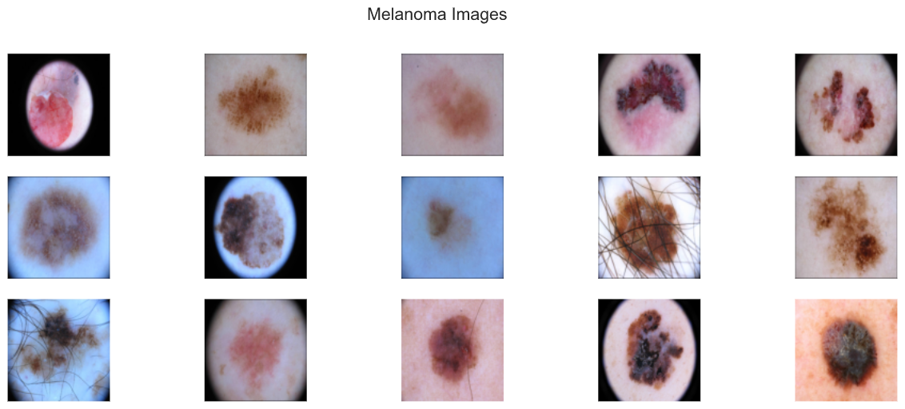
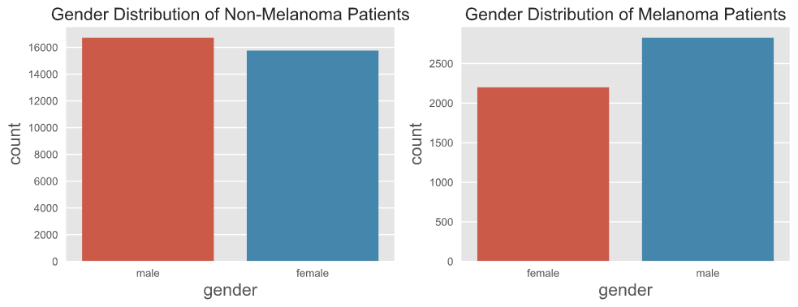

<h1>
Developing a Melanoma Detector
</h1>

<h2>
by Steven Yan
</h2>

**Presentation Link:** https://prezi.com/view/JoLKnGuw0ZFBYFZra0c3/

# Flask application

While I had been exploring implementation through Flutter for app deployment, Flask seemed much more feasible given my time constraints and level of expertise.

## Home page:

The homepage asks for the user to upload a JPEG of any size into the application and to press SUBMIT once done.

## Results page:

Upon pressing SUBMIT, you automatically get transferred to the Results page, and you are given a message to get the mole checked out or that it is just another beauty mark.  The confidence level of that prediction is also given.

 
 

# Overview

<figure>
    
    <figcaption>Sample of Moles from Non-Melanoma Patients</figcaption>
</figure>

Skin cancer is the most prevalent type of cancer with melanoma being responsible for 75% of skin cancer deaths despite being the least common type. According to the American Cancer Society, in 2021, about 106,000 new melanomas will be diagnosed with a 60/40 split between men and women, and just over 7000 people are expected to die of melanoma.  Melanoma is the deadliest form of skin cancer and is responsible for an overwhelming majority of skin cancer deaths.  When melanoma is detected early, the survival rate exceeds 95% and can be cured with minor surgery. which is the very reason why having access to some sort of screening process as essential to prevent unnecessary death.

<figure>
    
    <figcaption>Mnemonic Device for Melanoma Detection</figcaption>
</figure>
 
<figure>
    
    <figcaption>Sample of Moles from Melanoma Patients</figcaption>
</figure>

 
 
# Business Understanding:

Dermatologists can detect melanomas through a full-body visual inspection supplemented by their years of clinical experience, as well as combining techniques such as dermoscopy to see more deeply into the skin and to determine whether there is a need for biopsy and total body photography for patients with an excessive number of moles where high-resolution digital photos are taken as a baseline.  Recent studies have shown that detecting such lesions through image analysis and machine learning can be as reliable as if not more than a visit with the dermatologist.  

Deploying an app for public consumption that can screen for potential melanoma will prevent countless avoidable deaths and help stave off unnecessary future medical costs.  The project has also very little overhead for such a maximal effect, the biggest bang for your buck.  According to the American Journal of Preventive Medicine, the total yearly cost of skin cancer treatment in the United States is around 5 billion for non-melanoma skin cancers like BCC and SCC, while melanoma will cost around 3 billion.  

Lastly, it will begin to address some of the inherent social inequities in healthcare and equalize access to expert advice for people from every background.   According to the American Cancer Society, the 5-year survival rate of African-American patients is 69%, while for Caucasians it is 94%, granted the lifetime risk of getting melanoma is over 20 times higher than for non-Hispanic Caucasians.

What could also explain the difference in the survival rates?  Those very marginalized populations inherently have constructed a certain skepticism and reticence to relate to and seek advice from a doctor of a different ethnic background.  Some of these barriers have been constructed due to past offenses against the communities and some are purely cultural.  Creating such an mobile app would allow for access by such marginalized individuals and break down some of these initial barriers so that they may receive the care they truly need.
 
 
# Data Sources:

As the leading healthcare organization for informatics in medical imaging, the Society for Imaging Informatics in Medicine (SIIM)'s mission is to advance medical imaging informatics through education, research, and innovation in a multi-disciplinary community. SIIM is joined by the International Skin Imaging Collaboration (ISIC), an international effort to improve melanoma diagnosis. The ISIC Archive contains the largest publicly available collection of quality-controlled dermatoscopic images of skin lesions.

There are three public repositories curated by SIIM-ISCC that we relied on for the project:

**2020 ISIC Training Dataset:**

- 33,126 DICOM images with embedded metadata and JPEG images with 425 duplicates
- 33,126 metadata entries of patient ID, lesion ID, sex, age, and general anatomic site
- 33,126 entries of gold standard lesion diagnoses

The 2020 dataset contains 33,126 dermatoscopic training images of skin lesions from over 2000 patients, and the images are either in DICOM format, which is a common medical imaging data format or in JPEG and TYFRecord format.  DICOM files contain both the image and metadata, but the metadata is also provided outside of the DICOM format in CSV format, which includes the following features:

1. patient ID
2. gender
3. approximate age
4. location of imaged site,
5. diagnosis information
6. indicator of malignancy
7. binarized version of target variable (melanoma or not melanoma)

This will be the original training set for our project, which consists of 33126 dermatoscopic images. An overwhelming majority of these images are non-melanocytic, hence benign. Out of 33126 images, only a mere 584 images contained melanoma or 1.8%. That is not only representative of a class imbalance, but a huge class imbalance.

**2019 ISIC Training Dataset:**

- 25,331 JPEG images of skin lesions
- 25,331 metadata entries of age sex general anatomic site, and common lesion identifier
- 25,331 entries of gold standard lesion diagnoses

This training dataset compiles the images from the following datasets:  BCN\_2000, HAM1000, and MSK.  25,331 images were available for training across 8 different categories.  The metadata contains information about the age and gender of the patient, as well as the lesion ID and anatomical site.  There are 8 diagnostic categories:  melanoma, nevus, basal cell carcinoma, acitinic keratosis, benign keratosis, dermatofibroma, vascular lesion, squamous cell carcinoma, and unknown.

I subsetted the melanoma images and inserted them as additional samples of the minority class into the original dataset.

**Additional minority class (melanoma) images added to original dataset:**  4522 

<figure>
    
    <figcaption>Different Types of Skin Cancer Including Non-Melanomic</figcaption>
</figure>

 
 

**2017 ISIC Training Dataset:**

- 2000 images in JPEG format and CSV with clinical metadata
	- 374 images diagnosed as melanoma and 1626 images as other diagnoses lumped into non-melanoma
- image\_id, age\_approximate, and sex
- 2000 entries of gold standard lesion diagnoses

The 2020 training dataset, supplemented with the 2019 melanoma images, form our training-validation-testing sets at a 80/10/10 split, and the 2017 training dataset becomes our additional testing or holdout set to see how well the model generalizes to unseen data.

 
 
# Data Understanding:

<figure>
    
    <figcaption>Age Distribution of Melanoma vs. Non-Melanoma Patients</figcaption>
</figure>

## Age Distribution

The visualizations illustrate a difference in the distribution of age between the melanoma vs. non-melanoma patients, but not so much between the training and testing datasets.  Upon calculation, for the training dataset, the mean age for melanoma patients is 60, while the mean age for non-melanoma patients is 50.  For the testing dataset, the median age for melanoma patients is also 60, while the mean age for non-melanoma patients is 45. 

According to the CDC, the average age of diagnosis is 63.  This seems to be in alignment with the higher median age of melanoma patients in our datasets.

<figure>
    
    <figcaption>Gender Distribution of Melanoma vs. Non-Melanoma Patients</figcaption>
</figure>

## Gender Distribution

There is a similar distribution in gender between the training and testing datasets.  When comparing melanoma vs. non-melanoma patients, there seems to be an unequal distribution in gender for the melanoma patients, and melanoma seems to affect males to a greater proportion than females, almost a 60/40 proportion.  This observation is in line with the published data.

According to the CDC, there is a 60/40 split in the melanoma population for males and females due to the fact that under 50, melanoma occurs more frequently in women, while above 50, occurs more often in men and increasingly so moving into 80.

<figure>
    
    <figcaption>Site Distribution of Melanoma vs. Non-Melanoma Patients</figcaption>
</figure>

## Site Distribution

When EDA was performed without the 2019 minority class additions, there was not a difference in site distribution between melanoma and non-melanoma patients.  With the addition of the 2019 melanoma instances, there is a difference in site distribution between melanoma and non-melanoma patients.  The 2019 melanoma instances separated the category of torso into more specific areas of the torso.  I lumped the anterior torso, posterior torso, lateral torso, and torso back into one category, which makes it apparent as overwhelmingly the most common anatomical site.  

There is one main difference between the training and testing datasets after the addition of the 2019 melanoma instances, which is that there are more instances at the head/neck and upper extremities sites.

Because UV damage can be the cause for melanoma, it can manifest in body areas that receive intermittent sun exposure, such as the trunk, legs, and arms, and consistently higher sun exposure, such as the face and head. More rarely, for instance, a melanoma grows on the soles of your feet, the palms of your hands, or even in the mucous membranes of your mouth, vagina, or anus.

 
 

# Modeling:

Until I addressed the class imbalance, I was unable to produce learning curves that looked anything that resembled what is to be expected.  I started with ImageDataGenerator and eventually used the Albumentation module to produce a formula for creating a transformation of every melanoma instance in the final training dataset.

I continued the modeling process on a 20% sample of the original dataset since even with the reduction each epoch would still take anywhere from 30 minutes to 2 hours depending on the complexity of the model and the chosen parameters.  I ran 20 epochs for each proposed model, and some of the results were produced after the capstone presentation.  

I started with experimenting with Densely Connected Network and moved quickly into Convolutional Neural Networks.  In my initial testing of models, only VGG16 produced a model that produced workable learning curves.  I simplified the model by lowering batch size, adding Dropout layers, removing some convolutional layers, and using EarlyStopping callback allowed me to finally to play around with different parameters and different models.

**Final Convolutional Neural Network rubric:**

- `Sequential()`
- 4 convolutional layers with input shape (256, 256, 3) with filters applied to extract different features:
	- filters: number of filters that convolutional layer will learn
	- `kernel_size`: specifies width and height of 2D convolutional window
	- padding:  `same` ensure that spatial dimensions are the same after convolution
	- activation:  activation function that will be applied for convolutional layers, use `relu`
	- `layers.Conv2D(input_shape=(224,224,3), filters=64, kernel_size=(3,3), padding="same", activation="relu"))`
- `Dropout(0.2)`
	- prevents model from overfitting since some number of layer outputs are randomly ignored or “dropped out"
- `MaxPooling2D()` 
	- To reduce dimensionality of images by reducing number of pixels in output
	- `layers.MaxPooling2D(pool_size=(2,2))`
- `Flatten()`
	- To be able to generate a prediction, flatten output of convolutional base
	- `layers.Flatten()`
- `Dense` layers feeds output of convolutional base to neurons
	- `layers.Dense(units=4096, activation="relu"))`
	- Loss function: for binary classification \`loss= ‘binary\_crossentropy’
	- last Dense layer should have unit of 1 and sigmoid as activation

I also trained the following transfer learning models with the dataset: VGG19, AlexNet, and ResNet50.
 
 

# Evaluation:

In handling imbalanced datasets, these were the metrics I monitored in the training process:

- Accuracy
- Precision (Positive Predictive Value)
- Recall (True Positive Rate)
- ROC-AUC Score (TPR vs. TNR)
- PR-AUC Score (Precision vs. Recall)

In selecting the best model in the training process, I looked predominantly at lowering validation loss with an eye to keeping the PR-AUC score high.  

In selecting the best model in comparing different models, I looked at overall accuracy and keeping False Negatives at the very minimum.  For medical applications, a false negative would have the greatest consequence for a patient, essentially not to be diagnosed with cancer when in fact he or she does have cancer.  For melanoma, early detection is absolutely essential since melanoma only becomes untreatable once it metastasizes to other parts of the body.

I evaluated each model on three testing datasets, the sampled testing set, and the original testing set from the 80-10-10 split, as well as the additional testing set from the 2017 ISIC Dataset.
 
 

# Results:

I had created two main holdout sets for testing, one from the original combined dataset and another from the ISIC 2017 dataset.

All the models performed well with the holdout set from the original dataset with around 93% accuracy, but the VGG16-based CNN model achieved a 94.5% accuracy.  On the additional holdout set, the models for the most part achieved a mere 60-70% accuracy, and only ResNet50 achieved a 80% accuracy.  ResNet50 achieved a 90% accuracy on the original holdout set.

 

However, what is concerning is that the large number of false negatives for ResNet50 on the additional holdout set.  Despite the model having 80% accuracy, 78% of it is accounted for by the true negatives and only a very small part of the True Positives.

 
 

# Next Steps:

- Running on GPU
    - Training models with entire dataset to see whether that improves results
- Ensemble Models
    - Try additional models to get better metrics for additional holdout set
- Flutter Implementation
    - Developing an app for deployment
- Pytorch Implementation
    - Expanding my repertoire of tools

  
  

# Folder Structure:

	├── README.md                   <- the top-level README for reviewers of this project
	├── _notebooks					<- folder containing all the project notebooks
	│   ├── albumentation.ipynb		<- notebook for displaying augmentations
	│   ├── EDA.ipynb				<- notebook for dataset understanding and EDA
	│   ├── folders.ipynb			<- notebook for image folder management
	│   ├── holdout.ipynb			<- notebook for predicting on holdout sets
	│   ├── preaugmentation.ipynb	<- notebook for models with imbalanced dataset
	│   ├── postaugmentation.ipynb	<- notebook for models with dataset post-augmentations
	│   ├── pretrained.ipynb		<- notebook for pretrained models
	│   └── utils.py  				<- py file with self-defined functions
	├── final_notebook.ipynb        <- final notebook for capstone project
	├── _data                       <- folder of csv files (csv)
	├── MVP Presentation.pdf		<- pdf of the MVP presentation
	└── utils.py					<- py file with self-defined functions

 
 

# References:

International Skin Imaging Collaboration. SIIM-ISIC 2020 Challenge Dataset. International Skin Imaging Collaboration [https://doi.org/10.34970/2020-ds01][4] (2020).

Rotemberg, V. _et al_. A patient-centric dataset of images and metadata for identifying melanomas using clinical context. _Sci. Data_ 8: 34 (2021). [https://doi.org/10.1038/s41597-021-00815-z][5]

ISIC 2019 data is provided courtesy of the following sources:

- BCN20000 Dataset: (c) Department of Dermatology, Hospital Clínic de Barcelona
- HAM10000 Dataset: (c) by ViDIR Group, Department of Dermatology, Medical University of Vienna; [https://doi.org/10.1038/sdata.2018.161][6]
- MSK Dataset: (c) Anonymous; [https://arxiv.org/abs/1710.05006][7] ; [https://arxiv.org/abs/1902.03368][8]

Tschandl, P. _et al_. The HAM10000 dataset, a large collection of multi-source dermatoscopic images of common pigmented skin lesions. _Sci. Data_ 5: 180161 doi: 10.1038/sdata.2018.161 (2018)

Codella, N. _et al_. “Skin Lesion Analysis Toward Melanoma Detection: A Challenge at the 2017 International Symposium on Biomedical Imaging (ISBI), Hosted by the International Skin Imaging Collaboration (ISIC)”, 2017; arXiv:1710.05006.

Marc Combalia, Noel C. F. Codella, Veronica Rotemberg, Brian Helba, Veronica Vilaplana, Ofer Reiter, Allan C. Halpern, Susana Puig, Josep Malvehy: “BCN20000: Dermoscopic Lesions in the Wild”, 2019; arXiv:1908.02288.

Codella, N. _et al_. “Skin Lesion Analysis Toward Melanoma Detection 2018: A Challenge Hosted by the International Skin Imaging Collaboration (ISIC)”, 2018; [https://arxiv.org/abs/1902.03368][9]

 
 

# Contact Information:

[4]:	https://doi.org/10.34970/2020-ds01
[5]:    https://doi.org/10.1038/s41597-021-00815-z
[6]:	https://doi.org/10.1038/sdata.2018.161
[7]:	https://arxiv.org/abs/1710.05006
[8]:	https://arxiv.org/abs/1902.03368
[9]:	https://arxiv.org/abs/1902.03368
